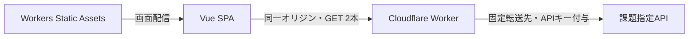
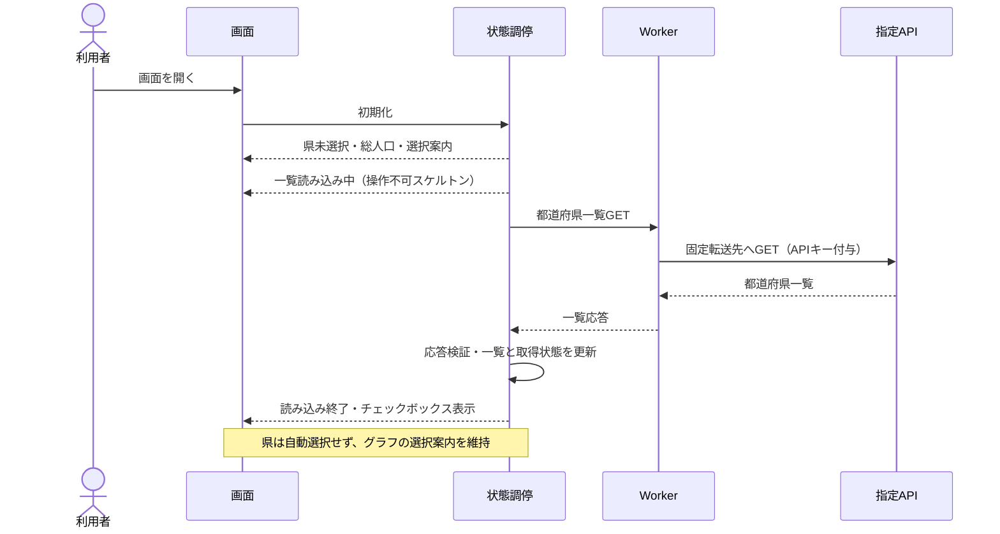
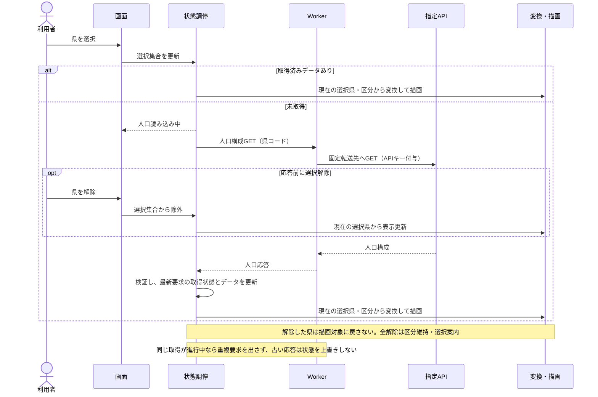
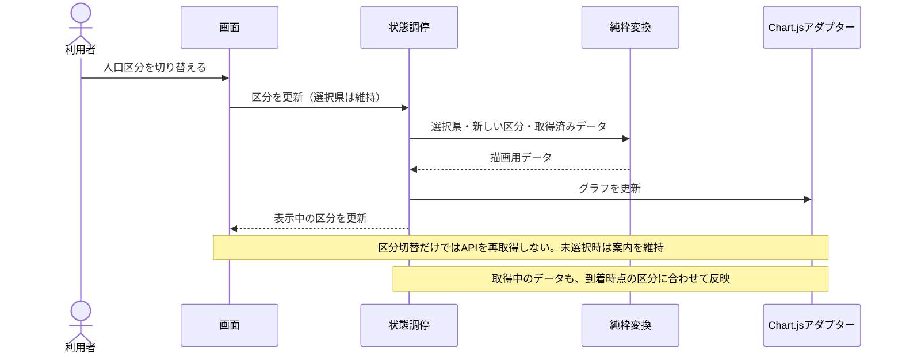
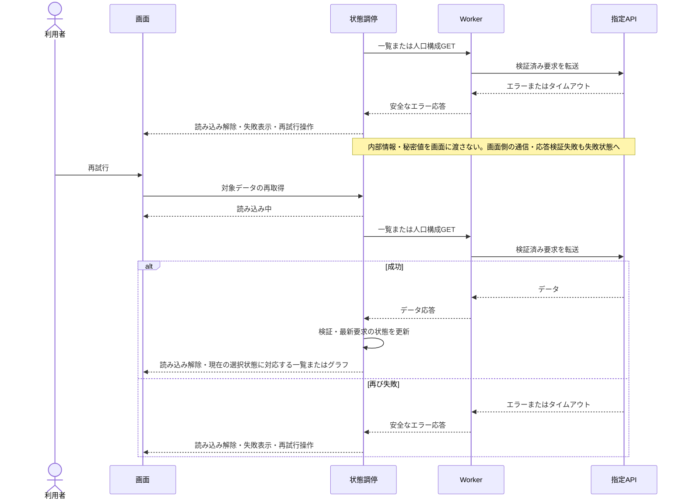

# 人口推移アプリ Design Doc

## 目的と範囲

[PRD](./PRD.md)の利用体験を、状態の整合性と変更しやすさを保って実現するための実装方針。技術選定は[ADR](./ADR.md)、画面の参照先は[デザインリンク](./DESIGN_LINKS.md)に従う。本書は設計を示し、実装済みの機能を示すものではない。

対象は都道府県選択、人口区分切替、推移グラフ、読み込み・失敗・再試行。一画面の規模に合わせ、認証・DB・SSR・大きな状態管理基盤は設けない。

## 全体構成

Vue 3・Vite・TypeScriptの画面とAPI中継を、公式Viteプラグインを使うWorkers構成で扱う。依存は必要なものに絞り、Pinia・Chart.jsのVueラッパー・Storybookは追加しない。依存導入はpnpm 12.8.1と[既存の依存管理方針](./DEPENDENCY_SECURITY.md)に従う。

## 責務とデータ境界

| 責務 | 担うこと |
| --- | --- |
| 汎用UI | チェックボックス、区分切替、案内・再試行などの表示と操作通知。取得処理や人口の業務判断を持たない。 |
| 人口機能の状態調停 | 選択県・区分・取得状態を管理し、操作から取得・表示更新へつなぐVue composable。 |
| API境界 | Workerは許可した要求だけを指定APIへ中継。画面側は応答を検証し、外部データとエラーを扱いやすい形へ整える。 |
| 純粋なデータ変換 | 選択県・区分・人口データから描画用データを作る。通信・DOM・Chart.jsを扱わず単独で検証できる。 |
| Chart.jsアダプター | 小さなコンポーネントで生成・更新・破棄を管理。選択状態や通信を所有せず、渡された描画用データを反映する。 |

[指定APIの契約](https://github.com/yumemi-inc/frontend-engineer-codecheck/blob/main/docs/api.md)に合わせ、県はコードと名称、人口は区分ごとの年と人口数を扱う。区分は配列位置に依存せず対応づけ、人口数には`value`を使い、割合の`rate`と混同しない。県・表示年・値をFigmaの仮データに固定しない。

## 状態と更新の方針

- 選択県のコード集合と人口区分を表示対象の唯一の正本にする。取得済みデータと取得状態は別に管理し、グラフ・件数・案内はcomputedで導出する。UIやChart.js側に同じ選択状態を複製しない。
- 初期状態は県未選択・総人口。区分変更では県を維持し、全解除では区分を維持する。県が未選択ならグラフ領域に「都道府県を選択すると、人口の推移を確認できます」を表示する。
- 人口構成の取得結果は県コード単位で画面滞在中に再利用する。同じ取得を重複させず、区分変更だけで再取得しない。永続化や複雑なキャッシュ基盤は設けない。
- 選択解除後に応答が届いても選択集合を書き換えない。最新の要求に対応する応答だけが取得状態を更新し、グラフは常に現在の選択集合から導出する。連続操作・再試行で古い応答が新しい状態を上書きすることを防ぐ。
- 一覧取得中は操作できないスケルトンを表示。人口取得中・取得失敗を識別できる表示と再試行を用意し、成功後は一覧またはグラフへ戻す。部分失敗専用の表示・再試行方式は要件として追加しない。

## 主要処理のシーケンス

図は責務間の処理方針を示す。表示は応答時点の選択状態から導出する。

### 初期表示と都道府県一覧取得

### 都道府県選択・取得再利用・解除

### 人口区分の切替

### 取得失敗と再試行

## API中継とセキュリティ

中継は都道府県一覧と人口構成の固定GET 2本に限定する。メソッド・パス・県コードを検証し、任意URL・不要なパラメータ・ブラウザからの認証ヘッダーを転送しない。上流への通信にはタイムアウトを設け、失敗を画面が扱えるエラーへ変換する。上流の内部情報や秘密値をレスポンス・ログへ出さない。

APIキーは実行時にWorker Secretsへ保持し、CIから設定する場合はGitHub Secretsを利用する。画面の配信物には含めない。公開中継の悪用対策は秘密値の保管とは別に扱い、公開前にアクセス制御・利用量制限を確認する。CI・配備の具体的なトリガーはIssue #12で扱う。

## 表示と操作

PC・タブレット・スマートフォンで領域の配置とグラフサイズを調整し、固定画面を縮小するだけにしない。47県まで選べる前提で、凡例・操作部品の折返しと連続操作時の読みやすさを確認する。県と線の対応を安定させ、色だけに頼らず名称でも識別できるようにする。

操作にはラベルとキーボード操作を備え、選択・展開・失敗などの状態をテキストでも伝える。Chart.jsのCanvasには説明を付け、人口区分と県・線の対応を画面側でも示す。

## 検証方針

TDDで、純粋変換・API境界・状態調停をVitest、部品の操作と表示をVue Test Utilsで検証する。標準機能のAPIモックを使い、正常・失敗・再試行に加え、解除後の遅延応答と区分切替時の選択維持を確認する。

PlaywrightとGoogle Chrome最新版で、PRDの操作、各画面幅、Chart.jsの実描画・更新・破棄を確認する。jsdomでCanvas描画成功を判定しない。実APIとの契約一致はモックとは別に確認する。ESLint・Prettier・Stylelintとvue-tscの型チェックも実行する。

## レビューで確認したい点

- 汎用UI・状態調停・API境界・純粋変換・描画の責務分担で、一画面に対して過剰な構成になっていないか。
- 選択状態を正本とし、画面滞在中の取得結果を再利用する方針で、連続操作時もPRDの振る舞いを維持できるか。

参考：[Vueの状態管理](https://vuejs.org/guide/scaling-up/state-management.html)、[composable](https://vuejs.org/guide/reusability/composables.html)、[Chart.js API](https://www.chartjs.org/docs/latest/developers/api.html)、[Workersの推奨事項](https://developers.cloudflare.com/workers/best-practices/workers-best-practices/)。
