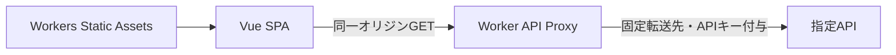

# アプリの設計

機能の受入条件は[PRD](./PRD.md)、画面の参照先は[デザインリンク](./DESIGN_LINKS.md)にまとめています。

## 採用技術と構成

Vue 3・Vite・TypeScriptのSPAを、公式Cloudflare ViteプラグインでWorkerとStatic Assetsとしてbuildします。グラフはChart.js単体、状態管理はVueのref・computed・composable。認証・DB・SSR・永続キャッシュは設けません。テストはVitest・Vue Test Utils・Playwright、品質チェックはESLint・Stylelint・Prettier・vue-tscです。固定版はpackage.jsonとlockfileで管理します。

| 場所                           | 役割                                                |
| ------------------------------ | --------------------------------------------------- |
| `src/App.vue`                  | loaderをページへ渡す入口                            |
| `src/pages/PopulationPage.vue` | 画面の組み立て、選択県と人口区分の正本              |
| `src/components/prefectures/`  | 一覧取得・検証、選択、開閉、一覧の状態表示          |
| `src/components/population/`   | 人口取得・検証、県別cache、系列の導出、Chart.js描画 |
| `src/components/shared/`       | 業務判断・通信を持たない汎用UI                      |
| `src/styles/`                  | 共通トークン・汎用部品の基本スタイル                |
| `worker/`                      | API要求検証、固定上流への中継、安全な失敗応答       |
| `tests/`                       | 単体・部品・Chromeテスト、合成fixture               |

## 選択とデータ取得

- 初期は県未選択・総人口。区分変更で県を維持し、全解除で区分を維持します。未選択時は人口通信を行わず、PRDの選択案内を表示します。
- 一覧はAPI順にチェックボックスを生成します。取得中は操作不可の47枠スケルトン、失敗時は再読み込みを表示します。閉じたスマホ一覧も取得を進め、開いた時点の取得状態を表示します。完了・失敗・再試行で開閉状態は変更しません。
- 640px未満は県一覧を初期closedにし、開閉状態と選択を維持します。640px以上は一覧を表示します。閉じた一覧はTab・支援技術の対象から外し、幅変更で操作が隠れる場合だけフォーカスを移します。
- 人口は県コード単位で全4区分を画面滞在中にcacheします。成功済み・取得中の要求を重複させず、区分変更では再取得しません。再試行は現在選択中の失敗県だけを取得します。
- 系列・件数・案内は現在の選択から導出します。解除後の応答で選択を復活させず、古い要求やscope終了後の応答で画面状態を上書きしません。追加取得中・一部失敗でも成功済み系列を保持します。
- 画面側のGETは本文読取を含む15秒timeout。一覧はcode/name・重複・空応答、人口は全4ラベル・年重複・非負整数値・任意rateを検証し、内部例外や応答本文を画面へ出しません。[APIの契約](./API_PROXY.md)を守ります。

## 共通UIの契約

Checkboxは`label`・booleanの`v-model`・任意の`disabled`を受け、操作で`update:modelValue`と`change`を各1回通知します。親更新やdisabled時は通知しません。ネイティブinput/labelのTab・Space・ラベルクリックを使います。

SingleSelectGroupはラジオ群として1区分を選択し、ラベル・checked・矢印キー操作をネイティブHTMLで扱います。Buttonはネイティブbuttonで、disabled時は通知しません。

StatusMessageは`state: empty | loading | error`・`title`・任意`description`・`headingLevel`（既定h3）を受け、操作は`action` slotへ渡します。再試行と成功後の表示は親の責務です。未選択/loadingはpolite status、errorはalertで通知し、読み上げ領域をbusy領域と操作slotの外に置きます。装飾アイコンは隠し、loading回転はreduced motionで停止します。

CheckboxSkeletonは装飾専用で操作要素を持ちません。一覧用スケルトンは47枠と1つの読み込みstatusを表示し、アニメーションは行いません。

## グラフ

元の全データ点を数値の年・人数で保持し、県ごとに年が異なっても配列indexで対応させません。初回にChartを生成、更新は同じinstanceへ`update('none')`、全解除・unmountで破棄します。Canvas描画は実Chromeで確認します。

横軸は年、縦軸の表示目盛りは万人、tooltipは桁区切り人数。横軸目盛りは推計を含む取得データの最小年・最大年を必ず表示し、中間は描画幅と年ラベルの実測幅に応じて重ならない間隔へ間引きます。県・区分変更とresizeで再計算し、元データを間引いたり偽の点を追加したりしません。

全系列は実線・直線補間・丸点です。県コード−1で47色の固定トークンへ対応し、選択順や再選択で色を変えません。Figmaの線種とは追加仕様により異なります。47色の判別可能性を保証せず、県名凡例・tooltip・視覚的に隠した県別年別のsemantic tableを併用します。可視の数値一覧・グラフ説明文は設けず、canvasのaccessible nameと視覚的に隠した軸説明を維持します。アニメーションは無効です。

## 品質と制限

[アクセシビリティ基準](./ACCESSIBILITY.md)に従い、ネイティブ操作・ラベル・状態通知・代替情報を用意します。PC・tablet・mobileの1440 / 768 / 390pxに加え320pxと境界幅でリフロー・47県・連続操作を確認します。

API中継は固定GET 2本のみ。APIキーはWorkerの実行時Secretで保持し、ブラウザへ渡しません。Rate LimitはIP単位200回/10秒の近似制限で、日次利用量や上流割当量を保証しません。[環境とSecrets](./CLOUDFLARE_ENVIRONMENT.md)を参照してください。WorkersはNode.jsと完全互換ではないため、利用APIの互換性とプランの制限を確認します。

実APIの値・失敗/retry、共有IPへの影響、スクリーンリーダーの読み上げ、操作時INPは実環境で別途確認します。モック・axe・静的UIのLighthouse成功だけでは完了としません。

## ライセンスと出典

採用ツール本体の公式LICENSEを確認した。

- MIT：[Vue](https://github.com/vuejs/core/blob/main/LICENSE)、[Vite](https://github.com/vitejs/vite/blob/main/LICENSE)、[Chart.js](https://github.com/chartjs/Chart.js/blob/master/LICENSE.md)、[Vitest](https://github.com/vitest-dev/vitest/blob/main/LICENSE)、[Vue Test Utils](https://github.com/vuejs/test-utils/blob/main/LICENSE)。
- MIT：[ESLint](https://github.com/eslint/eslint/blob/main/LICENSE)、[eslint-plugin-vue](https://github.com/vuejs/eslint-plugin-vue/blob/master/LICENSE)、[Prettier](https://github.com/prettier/prettier/blob/main/LICENSE)、[Stylelint](https://github.com/stylelint/stylelint/blob/main/LICENSE)、[vue-tsc](https://github.com/vuejs/language-tools/blob/master/LICENSE)。
- Apache-2.0：[TypeScript](https://github.com/microsoft/TypeScript/blob/main/LICENSE.txt)、[Playwright](https://github.com/microsoft/playwright/blob/main/LICENSE)。
- Cloudflare Viteプラグイン：[公式package.json](https://github.com/cloudflare/workers-sdk/blob/main/packages/vite-plugin-cloudflare/package.json)の宣言はMITで、リポジトリの[LICENSE-MIT](https://github.com/cloudflare/workers-sdk/blob/main/LICENSE-MIT)も確認した。

アクセシビリティ検査の`@axe-core/playwright`・axe-coreはMPL-2.0です。[公式ライセンス](https://github.com/dequelabs/axe-core/blob/develop/LICENSE)を参照してください。依存更新・配布時は推移依存を含め必要なライセンス条件を確認します。

設計の参照：[Vue composable](https://vuejs.org/guide/reusability/composables.html)、[Chart.js API](https://www.chartjs.org/docs/latest/developers/api.html)、[Workers Vue構成](https://developers.cloudflare.com/workers/framework-guides/web-apps/vue/)。
